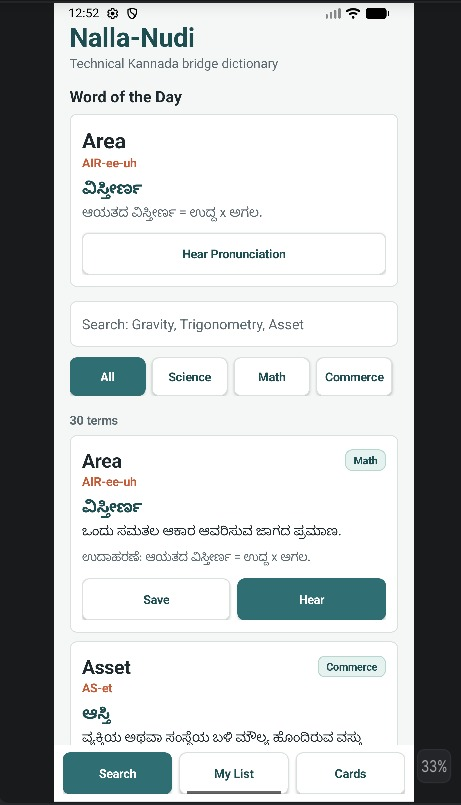
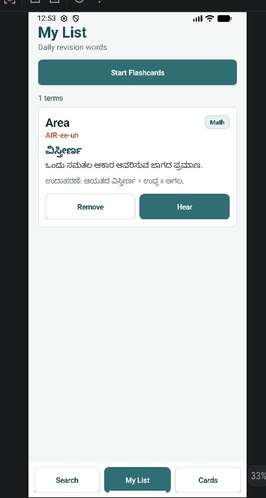
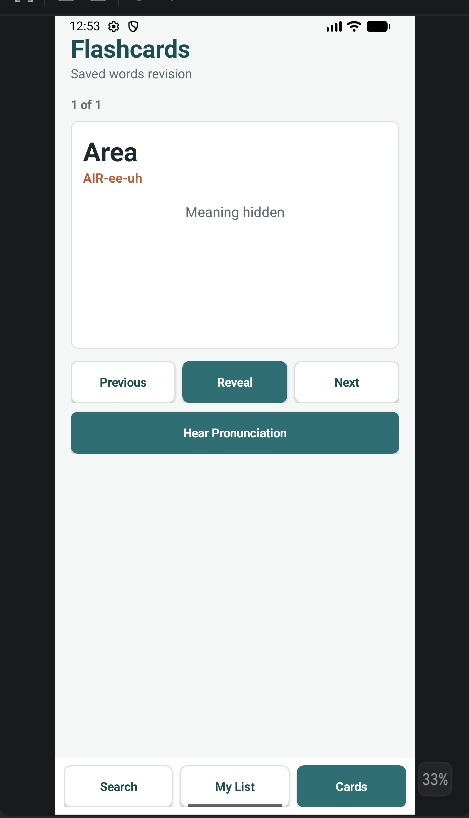

# Nalla Nudi – GenAI Education Mobile App

## 📚 Overview

**Nalla Nudi** is a Generative AI-powered educational mobile application designed to provide smart, personalized, and interactive learning support for students. The application helps users understand concepts through AI-generated explanations, summaries, and question-answer assistance.

The project combines **Artificial Intelligence**, **Mobile Application Development**, and **Educational Technology (EdTech)** to create an intelligent learning platform that improves accessibility and engagement in education.

---

# 🚀 Features

* 🤖 AI-powered educational assistance
* 📖 Real-time explanations and summaries
* ❓ Question-answer support using Generative AI
* 📱 User-friendly Android mobile interface
* 🔐 Secure user authentication
* ☁️ Cloud database integration
* ⚡ Fast and responsive performance
* 🎯 Personalized learning experience

---

# 🛠️ Technologies Used

## Frontend

* Kotlin
* XML Layouts
* Material Design Components
* Android Studio

## Backend

* Firebase Authentication
* Firebase Firestore
* REST APIs

## AI Integration

* Generative AI APIs
* Prompt Engineering

## Other Tools

* Git & GitHub
* Gradle
* Postman

---

# 📂 Project Structure

```text
NallaNudi/
  app/
    src/main/
      AndroidManifest.xml
      java/com/example/nallanudi/
        MainActivity.java
        data/
          NallaNudiDatabase.java
          SeedData.java
          Term.java
          TermDao.java
      res/values/
        strings.xml
        styles.xml
  build.gradle
  settings.gradle
```

---

# ⚙️ System Requirements

## Hardware Requirements

* Minimum 4 GB RAM
* Android device or Emulator
* Stable Internet Connection
* Minimum 64 GB Storage

## Software Requirements

* Android Studio
* Android SDK
* Kotlin / Java
* Firebase Account
* Generative AI API Access

---

# 🔄 Working Process

1. User enters a query or learning topic.
2. Application processes the input.
3. Request is sent to the Generative AI API.
4. AI generates educational content.
5. Response is displayed inside the application.
6. User receives personalized learning support.

---

# 📱 Screenshots

## Home Screen



## My List Screen



## Card Screen



---

# 📊 Problem Statement

Traditional educational systems often lack personalized and instant learning support for students. Many learners face difficulties understanding complex topics due to limited guidance and static learning materials.

Nalla Nudi solves this problem by using Generative AI to provide intelligent, real-time, and personalized educational assistance through a mobile platform.

---

# 🎯 Objectives

* To develop a smart educational mobile application.
* To integrate Generative AI for personalized learning.
* To provide real-time educational assistance.
* To improve accessibility and user engagement.
* To enhance learning through AI-generated content.

---

# 📈 Future Enhancements

* 🌐 Multilingual Support
* 🎤 Voice-based Interaction
* 📶 Offline Learning Support
* 📊 Learning Analytics Dashboard
* 🧠 Advanced AI Personalization
* 🏆 Gamification Features
* 👨‍🏫 Teacher-Student Collaboration

---

# 🧪 Testing

The application was tested using:

* Android Emulator
* Real Android Devices
* Manual Testing
* API Testing using Postman
* Debugging with Logcat

---

# 📌 Challenges Faced

* AI response delay due to API latency
* Managing accurate AI-generated content
* Cross-device compatibility issues
* Backend integration challenges
* Performance optimization

---

# ✅ Solutions Implemented

* Optimized API handling
* Improved prompt engineering
* Responsive UI implementation
* Continuous testing and debugging
* Efficient Firebase integration

---

# 📚 Learning Outcomes

Through this project, practical experience was gained in:

* Android App Development
* Firebase Integration
* Generative AI Integration
* Prompt Engineering
* UI/UX Design
* Debugging & Testing
* Real-world Software Development Practices

---

# 👨‍💻 Author

**Yash Raj**

* GitHub: (https://github.com/yashraj2508)

---

# 📄 License

This project is developed for educational and learning purposes.

---

# ⭐ Conclusion

Nalla Nudi is an intelligent educational mobile application that demonstrates the practical use of Generative AI in modern learning systems. The project successfully combines mobile application development with AI-powered educational support to create a smart, scalable, and user-friendly learning platform.
